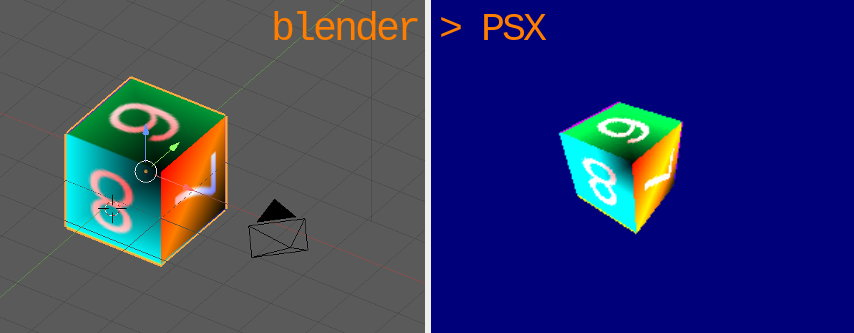
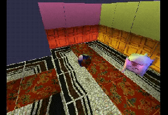
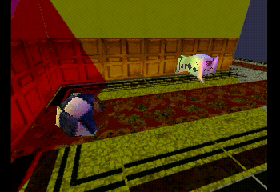
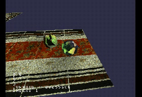
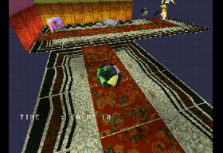
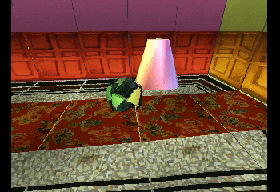
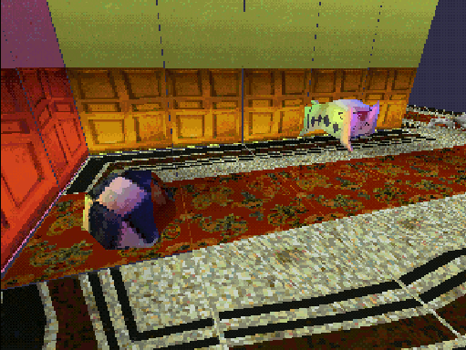

# Blender PSX Level export 

Blender <= 2.79c plugin to export gouraud shaded, UV textured PSX meshes in a scene to a C file.







## Features

**Be warned this is WIP** !

### Plugin

  * Export UV textured models
  * Export vertex painted models
  * Export camera positions for in game use
  * Export vertex animations
  * Export up to 3 light sources
  * Export pre-rendered backgrounds for in-game use (8bpp and 4bpp)

  
Real-time 3D / 8bpp background / 4bpp background
  
### "Engine"

  * Very basic physics / collision detection
  * Constrained camera trajectory
  * Orbital camera mode
  * Basic Spatial partitioning
  * Portal based camera angle switch
  * 3D sprite

## Planned

  * Fix and improve all the things !
  * VRam auto layout for TIMs
  * Wall collisions

Specifically, it generates a C file containing for each mesh in the scene:

  * an array of SVECTOR containing the vertices coordinates
  * an array of SVECTOR containing the normals
  * an array of SVECTOR containing the UV coordinates of the texture
  * an array of CVECTOR containing the color of each vertex
  * an array of int that describe the relation between the tri meshes
  * a TMESH struct to ease access to those arrays
  * declarations of the binary in memory
  * a TIM_IMAGE struct ready to host the image data

A few usefull stuff for manipulating the mesh :

  * a MATRIX that will hold the mesh tranformations
  * a VECTOR holding the object's location in world coordinates
  * a SVECTOR holding the object's rotation in PSX angle units (1 == 4096)
  * a flag isPrism for a pseudo-refraction effect. If 1, texture is the framebuffer draw area ( __WIP__ )
  * a long holding p, the depth-cueing interpolation value used by the PSX
  
  For easy access to those, a MESH struct is defined as :
  
```c
typedef struct MESH {  
	TMESH   *    tmesh;
	PRIM    *    index;
	TIM_IMAGE *  tim;  
	unsigned long * tim_data;
	MATRIX  *    mat;
	VECTOR  *    pos;
	SVECTOR *    rot;
	short   *    isRigidBody;
	short   *    isStaticBody;
	short   *    isPrism;
	short   *    isAnim;
	short   *    isActor;
	short   *    isLevel;
	short   *    isBG;
	short   *    isSprite;
	long    *    p;
	long    *    OTz;
	BODY    *    body;
	VANIM   *    anim;
	struct NODE   *    node;
	VECTOR       pos2D;
	} MESH;

```

## TMESH struct :
  
From `libgte.h`  :

```c
typedef struct {
        SVECTOR         *v;                     /*shared vertices*/
        SVECTOR         *n;                     /*shared normals*/
        SVECTOR         *u;                     /*shared texture addresses*/
        CVECTOR         *c;                     /*shared colors*/
        u_long          len;                    /*mesh length(=#vertex)*/
} TMESH;
```

# Install the plugin

Just `git clone` this repo in the addons folder of blender 2.79 :

You'll need to have [pngquant](https://pngquant.org/) and [img2tim](https://github.com/Lameguy64/img2tim) utilities installed and in your path for PNG to TIM conversion.

Windows executables are provided for convenience.

On Linux, that's :

`~/.config/blender/2.79/scripts/addons`

# Steps to convert your mesh

  1. You must first triangulate your mesh (manually or via the modifier).
    
  2. When your model is ready, you can then vertex paint it. If you don't, the vertices colors will default to white.
  
  * If you modify your geometry *after* vertex painting, the plugin will faile to export the mesh. This is because the vertex color data is set to 0 each time you modify your geometry.

  3. You can UV unwrap your model and apply a texture. The provided code will look for a tim file corresponding to the name of the image file you use in blender in the 'TIM' folder. 
E.g : You use a 'cube.png' file in blender, the psx code will look for a 'cube.tim' file in ./TIM 

  * If needed, edit the `primdraw.c` file , lines 29 and 30,  to reflect the number of tris you want to be able to draw ( Max seems to be ~750 in NTSC, ~910 in PAL )
  
```c
#define OT_LENGTH	2048	// Maximum number of OT entries
#define MAX_PRIMS	1024	// Maximum number of POLY_GT3 primitives
```
seem to be safe values.

# Compiling

The provided `Makefile`  uses the [Nugget+PsyQ setup](https://github.com/ABelliqueux/nolibgs_hello_worlds#setting-up-the-sdk--modern-gcc--psyq-aka-nuggetpsyq).

  1. Clone this repo in `(...)/pcsx-redux/src/mips/`
  2. Enter the `blender_io_export_psx_mesh` folder
  3. Install the plugin in blender, then open `level.blend`
  4. Export as 'level.c'
  5. Type `Make`

You can use [img2tim](https://github.com/Lameguy64/img2tim) to convert your blender texture in a tim file.

# Credits

Based on the [code](https://pastebin.com/suU9DigB) provided by TheDukeOfZill, 04-2014, on http://www.psxdev.net/forum/viewtopic.php?f=64&t=537#p4088

PSX code based on [example](http://psx.arthus.net/code/primdraw.7z) by [Lameguy64](https://github.com/Lameguy64)

pngquant : [https://github.com/kornelski/pngquant](https://github.com/kornelski/pngquant)

img2tim : [https://github.com/Lameguy64/img2tim](https://github.com/Lameguy64/img2tim)

Freeimage : [https://freeimage.sourceforge.io/](https://freeimage.sourceforge.io/)
