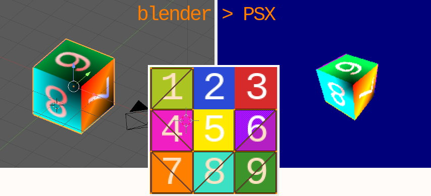

# Blender 3dcam PSX engine Level exporter

This Blender plugin is to be used in conjunction with the [3dcam PSX engine](https://github.com/ABelliqueux/3dcam-headers).  
It allows exporting a gouraud shaded, UV textured Blender scene to a format compatible with the aforementionned engine.  


[Check the Wiki](https://github.com/ABelliqueux/blender_io_export_psx_mesh/wiki) for in-depth informations.

## Features

**Be warned this is WIP** !

### Plugin

  * Export UV textured models
  * Export vertex painted models
  * Export camera positions for in game use
  * Export vertex animations
  * Export up to 3 light sources
  * Export pre-rendered backgrounds for in-game use (8bpp and 4bpp)
  * VRam auto layout for TIMs

  
Real-time 3D / 8bpp background / 4bpp background

## Planned

  * Fix and improve all the things !

# Install the plugin

**This plugin is not compatible with Blender > 2.79.**

1. Download and install Blender 2.79b.

http://download.blender.org/release/Blender2.79/

2. Clone this repository in the [addons folder](https://docs.blender.org/manual/en/latest/advanced/blender_directory_layout.html) of blender 2.79 :

```bash
git clone https://github.com/ABelliqueux/blender_io_export_psx_mesh.git
```
3. Enable the add-on in Blender by going to user preferences, Add-ons tab, and enable `Import-Export: PSX TMesh exporter`.  

You'll need to have [pngquant](https://pngquant.org/) and [img2tim](https://github.com/Lameguy64/img2tim) utilities installed and in your path for PNG to TIM conversion.  
Windows executables are provided for convenience in this repo.  
For users with Imagemagick installed, there is an option when exporting to use that instead of pngquant.  

On Linux : `~/.config/blender/2.79/scripts/addons`  
On macOS : `./Blender.app/Contents/Resources/2.79/addons`  
On Windows : `%USERPROFILE%\AppData\Roaming\Blender Foundation\Blender\2.93\`  

# Install the 3D engine

Head over to the [3dcam repo](https://github.com/ABelliqueux/3dcam-headers) and follow the setup instructions there.

# Credits

Based on the [code](https://pastebin.com/suU9DigB) provided by TheDukeOfZill, 04-2014, on http://www.psxdev.net/forum/viewtopic.php?f=64&t=537#p4088  
pngquant : [https://github.com/kornelski/pngquant](https://github.com/kornelski/pngquant)  
img2tim : [https://github.com/Lameguy64/img2tim](https://github.com/Lameguy64/img2tim)  
Freeimage : [https://freeimage.sourceforge.io/](https://freeimage.sourceforge.io/)  
